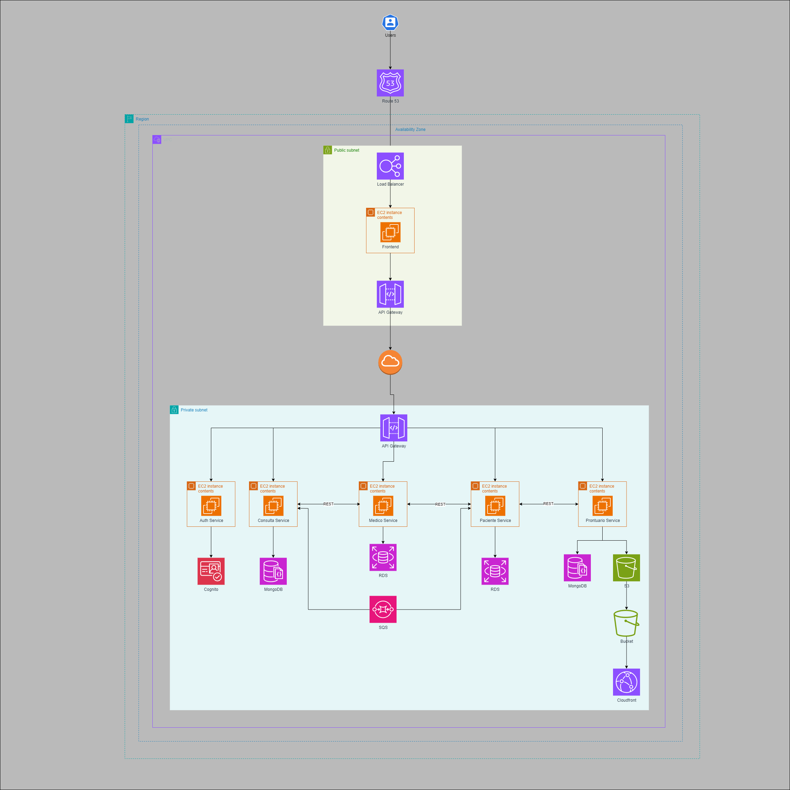

# Proposta de Arquitetura de Software para o Sistema de Telemedicina da Health&Med

## Índice
- [Visão Geral](#visão-geral)
- [Requisitos Funcionais](#requisitos-funcionais)
  - [Autenticação do Usuário (Médico)](#autenticação-do-usuário-médico)
  - [Cadastro/Edição de Horários Disponíveis (Médico)](#cadastroedição-de-horários-disponíveis-médico)
  - [Aceite ou Recusa de Consultas Médicas (Médico)](#aceite-ou-recusa-de-consultas-médicas-médico)
  - [Autenticação do Usuário (Paciente)](#autenticação-do-usuário-paciente)
  - [Busca por Médicos (Paciente)](#busca-por-médicos-paciente)
  - [Agendamento de Consultas (Paciente)](#agendamento-de-consultas-paciente)
  - [Teleconsulta](#teleconsulta)
  - [Prontuário Eletrônico](#prontuário-eletrônico)
- [Requisitos Não Funcionais](#requisitos-não-funcionais)
  - [Alta Disponibilidade](#alta-disponibilidade)
  - [Escalabilidade](#escalabilidade)
  - [Segurança](#segurança)
- [Arquitetura da Solução](#arquitetura-da-solução)
  - [Diagrama da Arquitetura](#diagrama-da-arquitetura)
  - [Descrição dos Componentes](#descrição-dos-componentes)
    - [Frontend](#frontend)
    - [API Gateway](#api-gateway)
    - [Microsserviços](#microsserviços)
      - [Auth Service](#auth-service)
      - [Medico Service](#medico-service)
      - [Paciente Service](#paciente-service)
      - [Consulta Service](#consulta-service)
      - [Prontuario Service](#prontuario-service)
  - [Comunicação entre Microsserviços](#comunicação-entre-microsserviços)
- [Database Services](#database-services)
  - [Amazon RDS](#amazon-rds)
  - [Amazon DynamoDB](#amazon-dynamodb)
  - [Amazon S3](#amazon-s3)
- [CloudFront](#cloudfront)
- [Segurança](#segurança)
  - [Criptografia](#criptografia)
  - [Gerenciamento de Identidade e Acesso (IAM)](#gerenciamento-de-identidade-e-acesso-iam)
  - [Monitoramento e Logs](#monitoramento-e-logs)
- [Escalabilidade e Alta Disponibilidade](#escalabilidade-e-alta-disponibilidade)
  - [Auto Scaling](#auto-scaling)
  - [RDS Multi-AZ](#rds-multi-az)
  - [S3 e CloudFront](#s3-e-cloudfront)
- [Infraestrutura como Código (IaC) com Terraform](#infraestrutura-como-código-iac-com-terraform)
  - [Diagrama da Infraestrutura com Terraform](#diagrama-da-infraestrutura-com-terraform)
  - [Descrição do Fluxo de Infraestrutura com Terraform](#descrição-do-fluxo-de-infraestrutura-com-terraform)
  - [Diagrama de Automação de CI/CD](#diagrama-de-automação-de-cicd)
  - [Descrição do Fluxo de Automação de CI/CD](#descrição-do-fluxo-de-automação-de-cicd)
- [Requisitos](#requisitos)
  - [Melhores Práticas de Qualidade e Arquitetura de Software](#melhores-práticas-de-qualidade-e-arquitetura-de-software)
  - [Práticas de Desenvolvimento Seguro](#práticas-de-desenvolvimento-seguro)
  - [Documentação Abrangente](#documentação-abrangente)
  - [Automatização da Infraestrutura](#automatização-da-infraestrutura)
- [Conclusão](#conclusão)


## Visão Geral

A Health&Med está desenvolvendo um sistema proprietário para telemedicina, substituindo soluções terceirizadas, visando maior qualidade, segurança dos dados dos pacientes e redução de custos. Este documento detalha a arquitetura do software com foco em arquitetos de software e desenvolvedores, fornecendo uma visão técnica abrangente para facilitar a implementação pelo time de desenvolvimento. O backend será implementado em .NET devido à familiaridade da equipe de desenvolvimento com essa tecnologia.

## Requisitos Funcionais

1. **Autenticação do Usuário (Médico)**
   - Login usando o número de CRM e senha.

2. **Cadastro/Edição de Horários Disponíveis (Médico)**
   - Cadastro e edição de horários disponíveis para consultas.

3. **Aceite ou Recusa de Consultas Médicas (Médico)**
   - Aceitação ou recusa de consultas agendadas.

4. **Autenticação do Usuário (Paciente)**
   - Login usando e-mail, CPF e senha.

5. **Busca por Médicos (Paciente)**
   - Visualização de médicos disponíveis com filtros por especialidade, distância e avaliação.

6. **Agendamento de Consultas (Paciente)**
   - Visualização da agenda do médico e agendamento de consultas.
   - Cancelamento de consultas com justificativa.

7. **Teleconsulta**
   - Criação de link de reunião online para a consulta agendada.

8. **Prontuário Eletrônico**
   - Acesso e upload de documentos médicos pelo paciente.
   - Compartilhamento de prontuário com médicos, controlando acesso e duração.

## Requisitos Não Funcionais

1. **Alta Disponibilidade**
   - Sistema disponível 24/7.

2. **Escalabilidade**
   - Suporte para até 20.000 usuários simultâneos.

3. **Segurança**
   - Alta segurança para prontuário eletrônico.
   - Proteção de dados sensíveis conforme melhores práticas.

## Arquitetura da Solução

### Diagrama da Arquitetura



### Descrição dos Componentes

#### Frontend

- **Funcionalidades**:
  - Interface responsiva para médicos e pacientes.
  - Integração com API Gateway para comunicação com os serviços backend.

#### API Gateway

- **Tecnologia**: AWS API Gateway
- **Funcionalidades**:
  - Roteamento de requisições para os microsserviços.
  - Autenticação, autorização e monitoramento.
  - Rate limiting para controle de tráfego.
- **Justificativa**:
  - O AWS API Gateway facilita a criação, publicação, manutenção, monitoramento e proteção de APIs em qualquer escala. Ele também oferece integrações nativas com outros serviços da AWS, o que simplifica a arquitetura.

### Microsserviços

Os microsserviços serão implementados em .NET, cada um responsável por uma funcionalidade específica. Cada serviço será containerizado usando Docker e orquestrado pelo Amazon ECS com AWS Fargate. A comunicação entre microsserviços será feita via HTTP/HTTPS através do API Gateway ou diretamente utilizando o AWS App Mesh para permitir a comunicação de serviço a serviço, com controle de tráfego, resiliência e segurança.

#### Auth Service

- **Tecnologia**: .NET, AWS Cognito
- **Funcionalidades**:
  - Gerenciamento de usuários (login, logout, recuperação de senha).
  - Emissão e validação de tokens JWT.
- **Endpoints**:
  - `POST /auth/login`
  - `POST /auth/logout`
  - `POST /auth/recover`
- **Implementação**:
  - Utilização de AWS Cognito para gerenciamento de usuários.
  - Emissão de tokens JWT para autenticação nas chamadas subsequentes.
- **Justificativa**:
  - AWS Cognito é um serviço de identidade que permite adicionar controle de autenticação, autorização e usuário às suas aplicações com facilidade. Ele se integra bem com outras soluções AWS e oferece suporte para padrões de segurança como OAuth 2.0, SAML e OpenID Connect.

#### Medico Service

- **Tecnologia**: .NET
- **Funcionalidades**:
  - Cadastro e edição de horários disponíveis.
  - Aceitação e recusa de consultas.
- **Endpoints**:
  - `POST /medico/horarios`
  - `PUT /medico/horarios/{id}`
  - `POST /medico/consultas/{id}/aceitar`
  - `POST /medico/consultas/{id}/recusar`
- **Persistência**:
  - Banco de dados RDS para armazenar informações dos médicos.
- **Implementação**:
  - APIs RESTful para interação com o frontend.
  - Persistência de dados em Amazon RDS.
  - Comunicação com o Consulta Service para atualização de status de consultas.
- **Justificativa**:
  - A escolha do Amazon RDS para o Medico Service é motivada pela necessidade de um banco de dados relacional robusto que assegure a consistência e integridade dos dados críticos dos médicos, tais como horários de disponibilidade e status das consultas. O Amazon RDS oferece alta disponibilidade com suporte Multi-AZ, garantindo a continuidade do serviço essencial para a operação contínua do sistema. Além disso, facilita a escalabilidade e o gerenciamento automatizado de backups, atualizações e patches de segurança, permitindo que a equipe de desenvolvimento se concentre em agregar valor ao negócio. A segurança avançada e o desempenho otimizado do RDS também são cruciais para proteger dados sensíveis e garantir uma experiência de usuário eficiente.

#### Paciente Service

- **Tecnologia**: .NET
- **Funcionalidades**:
  - Cadastro e edição de informações dos pacientes.
  - Busca por médicos e agendamento de consultas.
- **Endpoints**:
  - `POST /paciente`
  - `PUT /paciente/{id}`
  - `GET /medicos`
  - `POST /consultas`
  - `DELETE /consultas/{id}`
- **Persistência**:
  - Banco de dados RDS para informações dos pacientes e consultas.
- **Implementação**:
  - APIs RESTful para interação com o frontend.
  - Integração com serviços de terceiros para validação de CPF.
  - Comunicação com o Medico Service para busca de médicos e consulta de horários.
- **Justificativa**:
  - A escolha do Amazon RDS para o Paciente Service é fundamentada pela necessidade de um banco de dados relacional confiável para gerenciar informações sensíveis dos pacientes, como dados pessoais, históricos médicos e agendamentos de consultas.

#### Consulta Service

- **Tecnologia**: .NET
- **Funcionalidades**:
  - Criação de links de reunião online.
  - Gerenciamento de teleconsultas.
- **Endpoints**:
  - `POST /consultas/{id}/link`
- **Implementação**:
  - Integração com AWS Chime para criação de links de reuniões.
  - Armazenamento de links de reuniões em DynamoDB.
  - Comunicação com Medico Service e Paciente Service para atualizações de status de consultas e links de reuniões.
- **Justificativa**:
  - AWS Chime fornece uma solução completa para comunicações, permitindo a integração de funcionalidades de vídeo e voz em aplicações com facilidade.
  - A escolha do Amazon DynamoDB para o Consulta Service é motivada pela necessidade de um banco de dados NoSQL altamente escalável e de baixa latência, ideal para armazenar e gerenciar dados dinâmicos e voláteis como links de reuniões online e status de consultas. DynamoDB oferece uma escalabilidade automática e gerenciamento de capacidade provisionada, permitindo que o sistema lide eficientemente com variações de carga e grandes volumes de dados, sem a necessidade de gerenciamento manual. Além disso, a alta disponibilidade e a durabilidade dos dados são garantidas pela replicação automática entre múltiplas regiões, assegurando que o serviço esteja sempre disponível. A integração com outros serviços da AWS e a facilidade de uso do DynamoDB permitem que a equipe de desenvolvimento se concentre em aprimorar funcionalidades de negócio, oferecendo uma experiência de usuário rápida e confiável.

#### Prontuario Service

- **Tecnologia**: .NET
- **Funcionalidades**:
  - Upload e gerenciamento de documentos médicos.
  - Compartilhamento de documentos com médicos.
- **Endpoints**:
  - `GET /prontuario/{id}`
  - `POST /prontuario/{id}/upload`
  - `POST /prontuario/{id}/compartilhar`
- **Persistência**:
  - Amazon S3 para armazenamento de documentos.
  - Metadados armazenados no DynamoDB.
- **Implementação**:
  - Upload de documentos diretamente para Amazon S3.
  - Armazenamento de metadados de documentos em DynamoDB.
  - Controle de acesso aos documentos via AWS S3 Policies.
  - Comunicação com Paciente Service para gerenciamento de documentos e compartilhamento.
- **Justificativa**:
  - A escolha do Amazon S3 e do Amazon DynamoDB para o Prontuario Service é motivada pela necessidade de um armazenamento escalável, seguro e de alta disponibilidade para documentos médicos e metadados. O Amazon S3 é ideal para armazenar grandes volumes de documentos, como exames e laudos médicos, devido à sua alta durabilidade e escalabilidade, garantindo que os dados estejam sempre disponíveis e protegidos. Além disso, o S3 oferece criptografia de dados em repouso e controle de acesso granular, essenciais para a segurança dos dados sensíveis dos pacientes. O DynamoDB, por sua vez, é utilizado para armazenar os metadados dos documentos, proporcionando consultas rápidas e de baixa latência, o que é crucial para uma experiência de usuário eficiente. A combinação do S3 para armazenamento de arquivos e do DynamoDB para metadados permite uma gestão eficiente dos prontuários eletrônicos, atendendo às necessidades de segurança e performance do negócio.

### Comunicação entre Microsserviços

A comunicação entre os microsserviços será feita através do API Gateway para exposição de APIs públicas e do AWS App Mesh para comunicação direta entre serviços. Abaixo, detalhes de como a comunicação será gerenciada:

1. **API Gateway**:
   - Utilizado para comunicação entre o frontend e os microsserviços.
   - Também utilizado para chamadas públicas entre microsserviços, onde necessário.
- **Justificativa**:
  - API Gateway proporciona um ponto centralizado de gerenciamento e segurança para APIs, simplificando a comunicação entre componentes e garantindo uma gestão eficiente de autenticação e autorização.

2. **AWS App Mesh**:
   - Utilizado para comunicação interna entre microsserviços.
   - Proporciona controle de tráfego, resiliência e segurança.
   - Facilita a observabilidade e gerenciamento de rede.
- **Justificativa**:
  - AWS App Mesh permite a implementação de uma malha de serviço, proporcionando visibilidade e controle sobre o tráfego entre microsserviços, essencial para garantir a resiliência e a segurança da aplicação.

### Database Services

1. **Amazon RDS**
   - **Configuração**: Multi-AZ para alta disponibilidade.
   - **Uso**: Armazenamento de dados transacionais (médicos, pacientes, consultas).
   - **Configuração Detalhada**:
     - Configuração de snapshots automáticos para backup.
     - Monitoramento de desempenho usando CloudWatch.
     - Failover automático para instâncias em outra zona de disponibilidade.
- **Justificativa**:
  - Amazon RDS facilita a configuração, operação e escalabilidade de bancos de dados relacionais na nuvem. O suporte Multi-AZ garante alta disponibilidade e recuperação de desastres, essencial para uma aplicação crítica no setor de saúde.

2. **Amazon DynamoDB**
   - **Uso**: Armazenamento de dados de acesso rápido e escalável (metadados de documentos).
   - **Configuração Detalhada**:
     - Tabelas configuradas com chaves primárias compostas para acesso eficiente.
     - Capacidade de leitura e escrita provisionada com auto scaling.
     - Implementação de índices secundários globais para queries avançadas.
- **Justificativa**:
  - DynamoDB oferece uma solução de banco de dados NoSQL totalmente gerenciada e escalável, ideal para aplicações que exigem alta performance em leituras e escritas com baixa latência.

3. **Amazon S3**
   - **Uso**: Armazenamento de documentos médicos do prontuário eletrônico.
   - **Configuração Detalhada**:
     - Buckets configurados com políticas de acesso restrito.
     - Criptografia de dados em repouso usando KMS.
     - Integração com CloudFront para distribuição de documentos.
- **Justificativa**:
  - S3 é altamente durável e escalável, proporcionando armazenamento seguro para grandes volumes de dados, como documentos médicos, com políticas de acesso detalhadas e criptografia.

### CloudFront

- **Uso**: Distribuição de conteúdo estático (frontend) e documentos armazenados no S3.
- **Configuração Detalhada**:
  - Configuração de distribuições para baixa latência e alta disponibilidade.
  - Regras de cache para otimização de desempenho.
  - Integração com AWS WAF para proteção contra ataques DDoS.
- **Justificativa**:
  - CloudFront acelera a entrega de conteúdo ao distribuir globalmente e cachear arquivos próximos aos usuários finais, melhorando a performance da aplicação.

### Segurança

1. **Criptografia**:
   - **TLS**: Criptografia de dados em trânsito.
   - **KMS**: Criptografia de dados em repouso usando AWS Key Management Service.
   - **Configuração Detalhada**:
     - Certificados SSL/TLS gerenciados pelo AWS Certificate Manager.
     - Chaves de criptografia gerenciadas pelo AWS KMS com políticas de rotação.
- **Justificativa**:
  - TLS e KMS garantem que os dados estejam protegidos tanto em trânsito quanto em repouso, atendendo aos requisitos de segurança e conformidade.

2. **Gerenciamento de Identidade e Acesso (IAM)**:
   - **Políticas IAM**: Definição de políticas detalhadas para controle de acesso aos recursos AWS.
   - **MFA**: Autenticação multi-fator para usuários administradores.
   - **Configuração Detalhada**:
     - Políticas de IAM baseadas em funções para controle de acesso granular.
     - Implementação de roles específicas para cada serviço e microsserviço.
     - Configuração de MFA obrigatória para acesso administrativo.
- **Justificativa**:
  - IAM permite a definição de políticas de acesso refinadas, garantindo que os usuários tenham apenas as permissões necessárias para desempenhar suas funções, aumentando a segurança da infraestrutura.

3. **Monitoramento e Logs**:
   - **CloudWatch**: Monitoramento de métricas e logs das aplicações e infraestrutura.
   - **CloudTrail**: Auditoria de ações na conta AWS para rastreabilidade.
   - **Configuração Detalhada**:
     - Dashboards customizáveis para monitoramento em tempo real.
     - Alarmes configurados para alertar sobre problemas de desempenho ou disponibilidade.
     - Integração com AWS Lambda para ações automatizadas em resposta a eventos.
- **Justificativa**:
  - CloudWatch e CloudTrail fornecem visibilidade completa sobre a operação e segurança da aplicação, permitindo resposta rápida a incidentes e conformidade com auditorias.

### Escalabilidade e Alta Disponibilidade

1. **Auto Scaling**:
   - Configuração de auto scaling para serviços ECS com AWS Fargate, garantindo escalabilidade conforme a demanda.
   - **Configuração Detalhada**:
     - Regras de auto scaling baseadas em métricas de CPU, memória e requisições.
     - Políticas de escalabilidade para ajustar a capacidade conforme a demanda.
- **Justificativa**:
  - Auto Scaling assegura que a aplicação pode lidar com variações na carga de trabalho, ajustando automaticamente a capacidade para manter a performance e a disponibilidade.

2. **RDS Multi-AZ**:
   - Banco de dados relacional configurado em Multi-AZ para alta disponibilidade e failover automático.
   - **Configuração Detalhada**:
     - Configuração de réplicas de leitura para distribuição de carga.
     - Implementação de políticas de backup e recuperação.
- **Justificativa**:
  - Multi-AZ proporciona alta disponibilidade e resiliência para o banco de dados, essencial para uma aplicação crítica no setor de saúde.

3. **S3 e CloudFront**:
   - Uso de S3 para armazenamento redundante e CloudFront para entrega rápida de conteúdo.
   - **Configuração Detalhada**:
     - Configuração de políticas de versão para S3.
     - Distribuição global com CloudFront para baixa latência.
- **Justificativa**:
  - A combinação de S3 e CloudFront garante que os dados estejam sempre disponíveis e possam ser acessados rapidamente por usuários em qualquer lugar do mundo.

### Infraestrutura como Código (IaC) com Terraform

Para implementar a infraestrutura da Health&Med utilizando Terraform, é essencial visualizar como os componentes serão configurados e interconectados. Abaixo está um diagrama que ilustra a infraestrutura e seus principais componentes provisionados com Terraform.

#### Diagrama da Infraestrutura com Terraform

```plaintext
                                +----------------------+
                                |     AWS Account      |
                                +----------------------+
                                          |
                                          v
                  +------------------------------+          +---------------------+
                  |      Terraform Configuration  |          |   Terraform State  |
                  +------------------------------+          +---------------------+
                                          |
                                          v
                              +------------------------+
                              |        AWS VPC         |
                              |        (10.0.0.0/16)   |
                              +----------+-------------+
                                         |
            +------------+------------+------------+-------------+
            |                         |                         |
            v                         v                         v
 +------------------+       +------------------+        +------------------+
 | Public Subnet 1  |       | Public Subnet 2  |        | Public Subnet 3  |
 |  (10.0.1.0/24)   |       |  (10.0.2.0/24)   |        |  (10.0.3.0/24)   |
 +--------+---------+       +--------+---------+        +--------+---------+
          |                          |                          |
          v                          v                          v
 +------------------+       +------------------+        +------------------+
 |    NAT Gateway   |       | Application LB   |        |    NAT Gateway   |
 +--------+---------+       +--------+---------+        +--------+---------+
          |                          |                          |
          |                          v                          |
          |              +-----------------------+              |
          |              |     ALB Listeners     |              |
          |              +----------+------------+              |
          |                         |                           |
          v                         v                           v
 +------------------+       +------------------+        +------------------+
 | Private Subnet 1 |       | Private Subnet 2 |        | Private Subnet 3 |
 |  (10.0.10.0/24)  |       |  (10.0.11.0/24)  |        |  (10.0.12.0/24)  |
 +--------+---------+       +--------+---------+        +--------+---------+
          |                          |                          |
          v                          v                          v
 +-------------------+     +-------------------+      +-------------------+
 | ECS Service (1)   |     | ECS Service (2)   |      | ECS Service (3)   |
 +--------+----------+     +--------+----------+      +--------+----------+
          |                          |                          |
          v                          v                          v
 +-------------------+     +-------------------+      +-------------------+
 |   RDS (Database)  |     |  DynamoDB Tables  |      |      S3 Buckets   |
 +-------------------+     +-------------------+      +-------------------+
                                          |
                                          v
                                +----------------------+
                                |   CloudWatch Logs    |
                                +----------------------+
```

### Descrição do Fluxo de Infraestrutura com Terraform

1. **Terraform Configuration**:
   - Os arquivos de configuração do Terraform definem todos os recursos a serem provisionados na AWS, incluindo VPC, subnets, gateways, ALB, ECS clusters, RDS, DynamoDB e S3.
   - Utilização do Terraform State para manter o estado atual da infraestrutura provisionada.

2. **AWS VPC (10.0.0.0/16)**:
   - Criação de uma VPC para isolar a rede da aplicação.
   - Divisão da VPC em subnets públicas e privadas distribuídas em diferentes zonas de disponibilidade para alta disponibilidade.

3. **Public Subnets**:
   - **Subnets**: 10.0.1.0/24, 10.0.2.0/24, 10.0.3.0/24.
   - **NAT Gateway**: Implantado em subnets públicas para permitir que instâncias em subnets privadas acessem a Internet sem serem expostas diretamente.
   - **Application Load Balancer (ALB)**: Distribui o tráfego de entrada entre as instâncias de ECS nas subnets privadas.

4. **Private Subnets**:
   - **Subnets**: 10.0.10.0/24, 10.0.11.0/24, 10.0.12.0/24.
   - **ECS Service**: Hospeda os microsserviços do sistema de telemedicina, escalando conforme necessário.
   - **RDS**: Banco de dados relacional para armazenamento de dados estruturados.
   - **DynamoDB**: Banco de dados NoSQL para armazenamento de metadados de documentos e dados de alta velocidade.
   - **S3 Buckets**: Armazenamento de documentos médicos e outros arquivos grandes.

5. **Security Groups**:
   - Definição de regras de segurança para controlar o tráfego de rede entre os componentes da infraestrutura.

6. **CloudWatch Logs**:
   - Monitoramento e coleta de logs de todas as instâncias e serviços para auditoria, monitoramento de desempenho e solução de problemas.


### Diagrama de Automação de CI/CD

Para a implementação do pipeline de CI/CD (Continuous Integration and Continuous Deployment) com AWS CodePipeline, AWS CodeBuild e AWS CodeDeploy, abaixo está um diagrama ilustrando o fluxo completo desde o commit no Git até a implantação na infraestrutura de produção.

#### Diagrama do Pipeline de CI/CD

```plaintext
              +------------------+
              |    Desenvolvedor  |
              +--------+---------+
                       |
                       v
               +---------------+
               |  Repositório  |
               |    GitHub     |
               +-------+-------+
                       |
                       v
               +---------------+
               | AWS CodePipeline|
               +-------+-------+
                       |
                       v
   +------------------+  +---------------------+
   |  Fase de Build   |  |    Fase de Teste    |
   | AWS CodeBuild    |  |   AWS CodeBuild     |
   +------------------+  +---------------------+
                       |             |
                       v             v
               +-------------------------+
               |     Fase de Deploy      |
               |   AWS CodeDeploy        |
               +-----------+-------------+
                           |
                           v
     +-------------+-------+-------+---------------+
     |             |               |               |
+----------+  +----------+    +----------+    +----------+
|  ECS Dev |  |  ECS QA  |    |  ECS Prod|    | CloudWatch|
+----------+  +----------+    +----------+    +-----------+
```

### Descrição do Fluxo de Automação de CI/CD

1. **Desenvolvedor**:
   - Faz commits de código no repositório GitHub.
   - O código pode incluir novas funcionalidades, correções de bugs, ou melhorias.

2. **GitHub Repositório**:
   - Armazena o código-fonte do projeto.
   - Configurado com webhooks para integrar com AWS CodePipeline.
   - Qualquer mudança no repositório (commit, pull request) aciona o pipeline de CI/CD.

3. **AWS CodePipeline**:
   - Orquestra o fluxo completo de CI/CD.
   - Configura diferentes estágios, incluindo build, teste e deploy.
   - Garante que cada estágio é completado com sucesso antes de passar para o próximo.

4. **Fase de Build (AWS CodeBuild)**:
   - Compila o código e resolve dependências.
   - Gera artefatos de build que serão utilizados nos estágios seguintes.
   - Inclui configuração de scripts de build (por exemplo, buildspec.yml).

5. **Fase de Teste (AWS CodeBuild)**:
   - Executa testes automatizados (unitários, integração, etc.).
   - Garante que o código atende aos critérios de qualidade antes de prosseguir.
   - Relatórios de testes são gerados e armazenados.

6. **Fase de Deploy (AWS CodeDeploy)**:
   - Implanta os artefatos de build nas instâncias ECS.
   - Pode incluir diferentes ambientes (Desenvolvimento, QA, Produção).
   - Usa estratégias de implantação como rolling updates para minimizar downtime.

7. **ECS (Elastic Container Service)**:
   - **ECS Dev**: Ambiente de desenvolvimento para testes iniciais.
   - **ECS QA**: Ambiente de qualidade para testes mais abrangentes.
   - **ECS Prod**: Ambiente de produção onde o código final é implantado.

8. **CloudWatch**:
   - Monitora a saúde dos serviços e instâncias.
   - Coleta logs e métricas para análise e alertas.


## Requisitos 

1. **Melhores Práticas de Qualidade e Arquitetura de Software**
   - Princípios SOLID e Clean Code.
   - Arquitetura de microsserviços para alta modularidade e manutenção.

2. **Práticas de Desenvolvimento Seguro**
   - AWS Cognito para autenticação segura.
   - Criptografia de dados sensíveis em trânsito e em repouso.

3. **Documentação Abrangente**
   - Documentação detalhada de todos os componentes, endpoints de API, fluxos de CI/CD e infraestrutura na nuvem.

4. **Automatização da Infraestrutura**
   - Uso de Terraform para provisionamento automatizado de infraestrutura.
   - Pipelines de CI/CD para deploy automatizado e contínuo.

## Conclusão

A arquitetura proposta para o sistema de telemedicina da Health&Med é robusta, escalável e segura, utilizando as melhores práticas de desenvolvimento de software e infraestrutura. Com uma abordagem de microsserviços, AWS como provedor de infraestrutura e automação completa via Terraform e CI/CD, a Health&Med estará preparada para oferecer um serviço de alta qualidade e confiabilidade para seus usuários.
